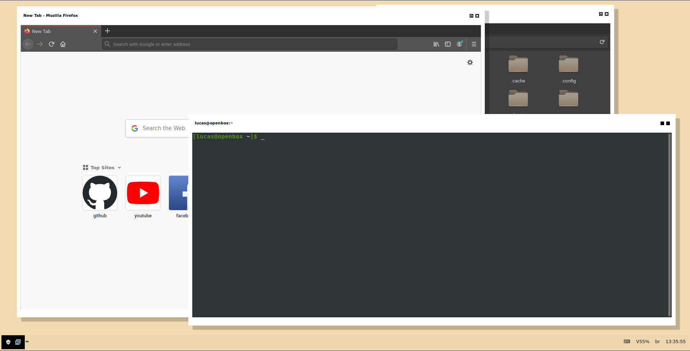
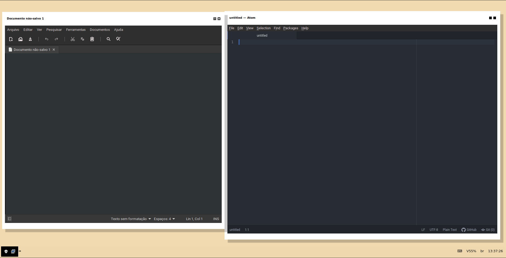

# coding-rice-installer
A script to install a theme for coding in _Openbox Manjaro/Arch_.

The original theme and setup is from [Weigert dotfiles](https://github.com/weigert/.dotfiles) I just added some improvements.

## Installation
* Clone it and go to terminal;
* type `cd coding-rice-installer`; 
* and run `./rice-install.sh`;
* Then reboot your machine;

## Recommendations
I recommend you to configure the terminal to have 132-columns and 27-lines. I also recommend to set the fonts of applications to one of the new fonts the script install and if you can, install other fonts you like to use. If you still want better font configuration and rendering I recommend to install the [freetype2-ultimate5](https://aur.archlinux.org/packages/freetype2-ultimate5/) package.

## Extras
The script improves fonts configuring and it comes with other fonts for better reading by default. The color of the bar in the bottom is set to transparent to may be used with other wallpapers you want to. You just have to change the text color depending of the wallpaper to a better reading, and if you use battery you can active the module inside *polybar/config* file. \ 
If you have any issue when installing on _Arch_ or other _Arch-based_ systems, there are some packages that come pre-installed on _Manjaro_ you should already have installed, to see what packages are, see inside the script. Also are used some of the [xapps](https://www.archlinux.org/packages/community/x86_64/xapps/) in the setup. \
\
Another image with the two main code editors (_xed_ and _atom_).

